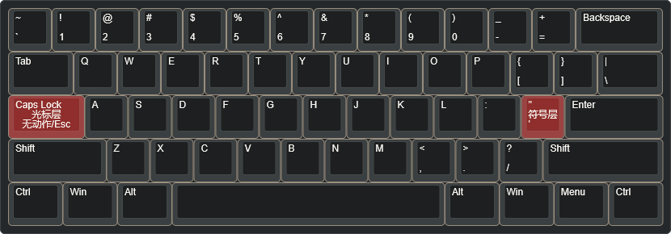
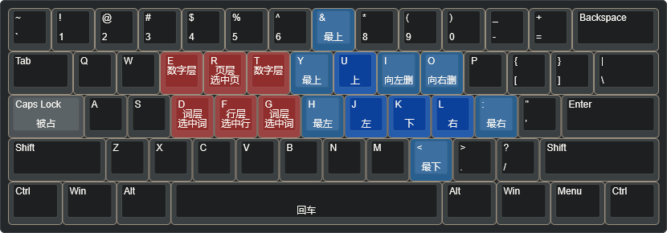
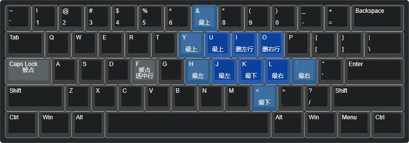
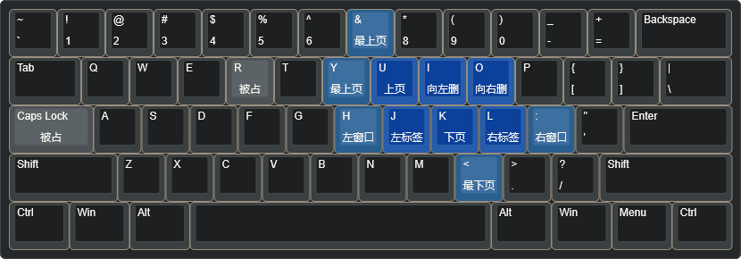
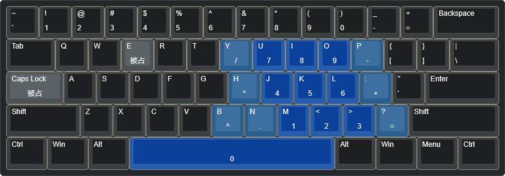
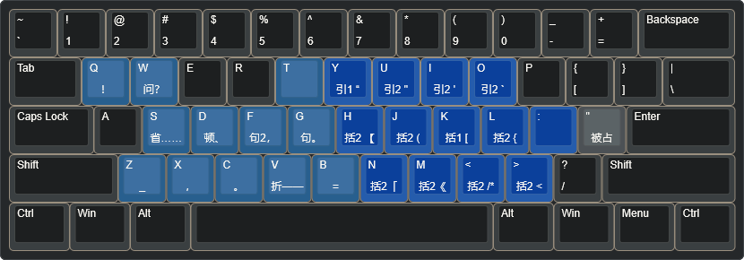

## 使用

exe是可执行程序，如果你是windows，直接用这个就行了。
如果你是MacOS或Linux，或想使用最新版，到Github找Kanata仓库下载

kanata.kbd 是脚本，与exe在同一目录下，双击exe就可以运行了！

有不了解的地方，可以见脚本中的注释，或者见我官网中，产品文档的部分或Kanata的笔记部分

## 教程

感谢 https://keyboard-layout-editor.com/ 提供的键盘快捷键示意图生成方案

图片使用说明: 中间表示长按，下面表示短按

## 默认层

## Caps-光标层

Caps 与其子层与 Shift 按键完全兼容，**可以同时按住 Caps 和 Shift 进行选择**

## Caps-词层

(相当于按住Ctrl键的光标层，光标的左右移动会以单词为单位)

## Caps-行层

## Caps-页层

## Caps-数字层

## 符号层

> [!warning]
> with bug，当前的成对括号部分存在问题，无法在保证快速的前提下识别是否有选中内容

